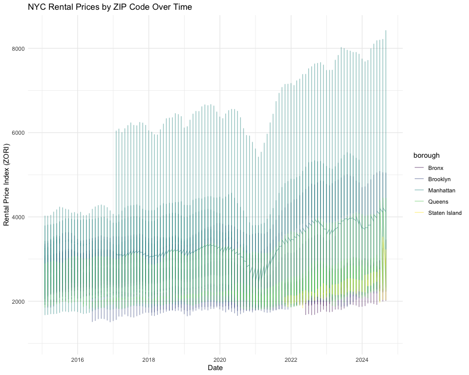
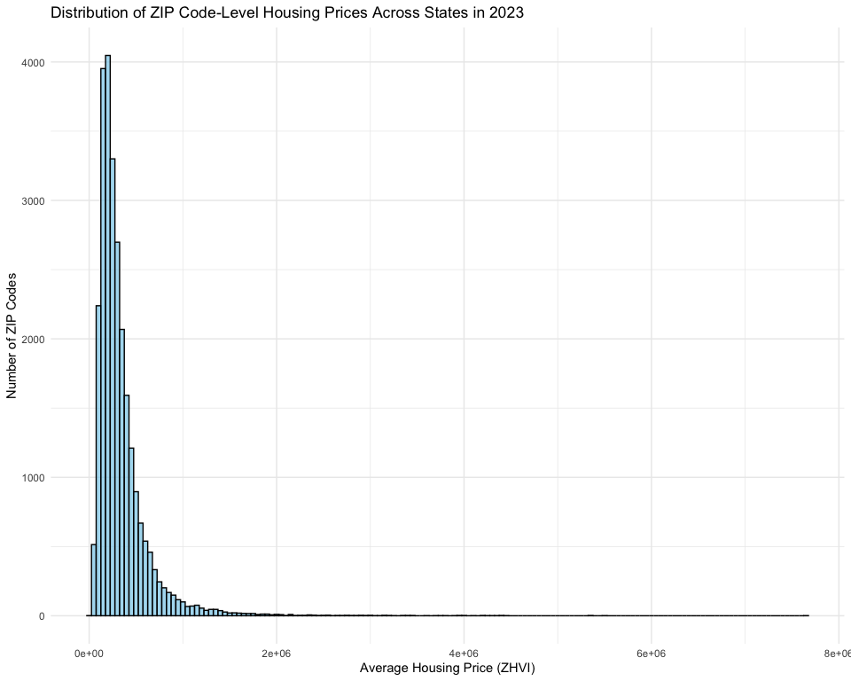
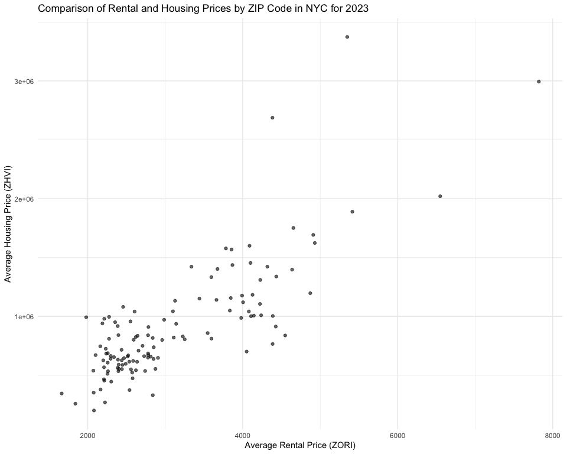

p8105_mtp_Cr3442
================
Cheng Rao
2024-10-24

# Report

## Problem 1 – Data Import and Cleaning

### Introduction

First, I imported and clean the data by 3 steps.

### Step 1: Import and Clean NYC Rental Data

``` r
# Import NYC Rental Data and ZIP Code Data
nyc_rental = read_csv("./data/Zip_zori_uc_sfrcondomfr_sm_month_NYC.csv") %>%
  janitor::clean_names()

# Import Supplementary Dataset to Get Borough and Neighborhood Information
zip_data = read_html("./data/supplementary dataset.html") %>%
  html_table() %>%
  .[[1]] %>%
  janitor::clean_names() %>%
  mutate(
    borough = case_when(
      county == "New York" ~ "Manhattan",
      county == "Kings" ~ "Brooklyn",
      county == "Queens" ~ "Queens",
      county == "Bronx" ~ "Bronx",
      county == "Richmond" ~ "Staten Island"
    )
  )

# Standardize ZIP Code Column Name
nyc_rental = nyc_rental %>%
  rename(zip_code = region_name) %>%
  mutate(zip_code = as.character(zip_code))

# Ensure ZIP Code Column in Supplementary Data is Character Type
zip_data = zip_data %>%
  mutate(zip_code = as.character(zip_code))

# Merge NYC Rental Data with ZIP Code Data
nyc_data = nyc_rental %>%
  left_join(zip_data, by = "zip_code") %>%
  filter(!is.na(borough)) %>%  # Filter Out Rows Without Matching Borough
  select(zip_code, neighborhood, borough, county, starts_with("x"))  
```

### Step 2: Import and Clean ZHVI Data

``` r
# Import ZHVI Data
zhvi_data = read_csv("./data/Zip_zhvi_uc_sfrcondo_tier_0.33_0.67_sm_sa_month_2023.csv") %>%
  janitor::clean_names() %>%
  rename(zip_code = region_name) %>%
  mutate(zip_code = as.character(zip_code))

# Convert ZHVI Data to Long Format
zhvi_long = zhvi_data %>%
  pivot_longer(
    cols = starts_with("x"),
    names_to = "date",
    values_to = "zhvi_price"
  ) %>%
  mutate(date = as.Date(date, format = "x%Y_%m_%d"))  
```

### Step 3: Convert ZORI Data to Long Format

``` r
# Convert ZORI Data to Long Format
zori_long = nyc_data %>%
  pivot_longer(
    cols = starts_with("x"),
    names_to = "date",
    values_to = "zori_rental_price"
  ) %>%
  mutate(date = as.Date(date, format = "x%Y_%m_%d")) 
```

## Problem 2 – Quality Control and EDA

### Question 1: Explian the reason

### Question 2: Compare the number

``` r
# Count ZIP Codes in NYC Rental Dataset
num_zip_rental = nyc_rental %>%
  distinct(zip_code) %>%
  nrow()

# Count ZIP Codes in ZIP Code Dataset
num_zip_data = zip_data %>%
  distinct(zip_code) %>%
  nrow()

# Print the counts
cat("Number of ZIP Codes in NYC Rental Dataset:", num_zip_rental, "\n")
```

    ## Number of ZIP Codes in NYC Rental Dataset: 149

``` r
cat("Number of ZIP Codes in ZIP Code Dataset:", num_zip_data, "\n")
```

    ## Number of ZIP Codes in ZIP Code Dataset: 320

### Question 3: Average Rental Price by Borough and Year

``` r
# Calculate Average Rental Price by Borough and Year
avg_rent_by_borough_year = zori_long %>%
  mutate(year = lubridate::year(date)) %>%
  group_by(borough, year) %>%
  summarise(avg_rental_price = mean(zori_rental_price, na.rm = TRUE)) %>%
  arrange(borough, year)

# Display Table
avg_rent_by_borough_year %>%
  knitr::kable(digits = 2, caption = "Average Rental Price by Borough and Year")
```

| borough       | year | avg_rental_price |
|:--------------|-----:|-----------------:|
| Bronx         | 2015 |          1759.60 |
| Bronx         | 2016 |          1520.19 |
| Bronx         | 2017 |          1543.60 |
| Bronx         | 2018 |          1639.43 |
| Bronx         | 2019 |          1705.59 |
| Bronx         | 2020 |          1811.44 |
| Bronx         | 2021 |          1857.78 |
| Bronx         | 2022 |          2054.27 |
| Bronx         | 2023 |          2285.46 |
| Bronx         | 2024 |          2496.90 |
| Brooklyn      | 2015 |          2492.93 |
| Brooklyn      | 2016 |          2520.36 |
| Brooklyn      | 2017 |          2545.83 |
| Brooklyn      | 2018 |          2547.29 |
| Brooklyn      | 2019 |          2630.50 |
| Brooklyn      | 2020 |          2555.05 |
| Brooklyn      | 2021 |          2549.89 |
| Brooklyn      | 2022 |          2868.20 |
| Brooklyn      | 2023 |          3015.18 |
| Brooklyn      | 2024 |          3125.66 |
| Manhattan     | 2015 |          3006.29 |
| Manhattan     | 2016 |          3014.57 |
| Manhattan     | 2017 |          3109.10 |
| Manhattan     | 2018 |          3159.67 |
| Manhattan     | 2019 |          3285.33 |
| Manhattan     | 2020 |          3091.33 |
| Manhattan     | 2021 |          3124.34 |
| Manhattan     | 2022 |          3753.08 |
| Manhattan     | 2023 |          3908.22 |
| Manhattan     | 2024 |          4052.81 |
| Queens        | 2015 |          2214.71 |
| Queens        | 2016 |          2271.96 |
| Queens        | 2017 |          2263.30 |
| Queens        | 2018 |          2291.92 |
| Queens        | 2019 |          2387.82 |
| Queens        | 2020 |          2315.63 |
| Queens        | 2021 |          2210.79 |
| Queens        | 2022 |          2406.04 |
| Queens        | 2023 |          2561.62 |
| Queens        | 2024 |          2693.58 |
| Staten Island | 2015 |              NaN |
| Staten Island | 2016 |              NaN |
| Staten Island | 2017 |              NaN |
| Staten Island | 2018 |              NaN |
| Staten Island | 2019 |              NaN |
| Staten Island | 2020 |          1977.61 |
| Staten Island | 2021 |          2045.43 |
| Staten Island | 2022 |          2147.44 |
| Staten Island | 2023 |          2332.93 |
| Staten Island | 2024 |          2536.44 |

Average Rental Price by Borough and Year

### Question 4: Rental Price Drop During COVID-19

``` r
# Compare Rental Prices in January 2021 to January 2020
covid_rent_drop = zori_long %>%
  filter(date == as.Date("2020-01-31") | date == as.Date("2021-01-31")) %>%
  pivot_wider(names_from = date, values_from = zori_rental_price) %>%
  mutate(price_drop = `2020-01-31` - `2021-01-31`) %>%
  group_by(borough) %>%
  filter(price_drop == max(price_drop, na.rm = TRUE)) %>%
  select(borough, neighborhood, price_drop)

# Display Table
covid_rent_drop %>%
  knitr::kable(digits = 2, caption = "Largest Rental Price Drop from 2020 to 2021 by Borough")
```

| borough   | neighborhood        | price_drop |
|:----------|:--------------------|-----------:|
| Queens    | West Central Queens |     216.97 |
| Brooklyn  | Greenpoint          |     437.94 |
| Bronx     | Southeast Bronx     |      16.46 |
| Manhattan | Lower Manhattan     |     912.60 |

Largest Rental Price Drop from 2020 to 2021 by Borough

## Problem 3 – Visualization

### Qusetion 1: NYC Rental Prices Over Time

``` r
# Plot NYC rental prices for each ZIP code over time
zori_long %>%
  ggplot(aes(x = date, y = zori_rental_price, color = borough)) +
  geom_line(alpha = 0.5) +
  labs(
    title = "NYC Rental Prices by ZIP Code Over Time",
    x = "Date",
    y = "Rental Price Index (ZORI)"
  ) +
  theme_minimal()
```



### Qusetion 2:2023 ZIP Code Housing Price Distribution Across States

``` r
# Calculate average housing price for each ZIP code in 2023
avg_zhvi_by_zip = zhvi_long %>%
  group_by(zip_code) %>%
  summarise(avg_zhvi_price = mean(zhvi_price, na.rm = TRUE))

# Plot the distribution of housing prices to compare across states
avg_zhvi_by_zip %>%
  ggplot(aes(x = avg_zhvi_price)) +
  geom_histogram(binwidth = 50000, fill = "skyblue", color = "black", alpha = 0.7) +
  labs(
    title = "Distribution of ZIP Code-Level Housing Prices Across States in 2023",
    x = "Average Housing Price (ZHVI)",
    y = "Number of ZIP Codes"
  ) +
  theme_minimal()
```



### Qusetion 3: 2023 NYC Rental Prices vs. Housing Prices

``` r
# Calculate the average monthly rental price and housing price for each ZIP code in 2023
zori_zhvi_2023 = zori_long %>%
  filter(lubridate::year(date) == 2023) %>%
  group_by(zip_code) %>%
  summarise(avg_rental_price = mean(zori_rental_price, na.rm = TRUE)) %>%
  left_join(
    zhvi_long %>%
      filter(lubridate::year(date) == 2023) %>%
      group_by(zip_code) %>%
      summarise(avg_zhvi_price = mean(zhvi_price, na.rm = TRUE)),
    by = "zip_code"
  )

# Plot rental prices against housing prices
zori_zhvi_2023 %>%
  ggplot(aes(x = avg_rental_price, y = avg_zhvi_price)) +
  geom_point(alpha = 0.6) +
  labs(
    title = "Comparison of Rental and Housing Prices by ZIP Code in NYC for 2023",
    x = "Average Rental Price (ZORI)",
    y = "Average Housing Price (ZHVI)"
  ) +
  theme_minimal()
```


